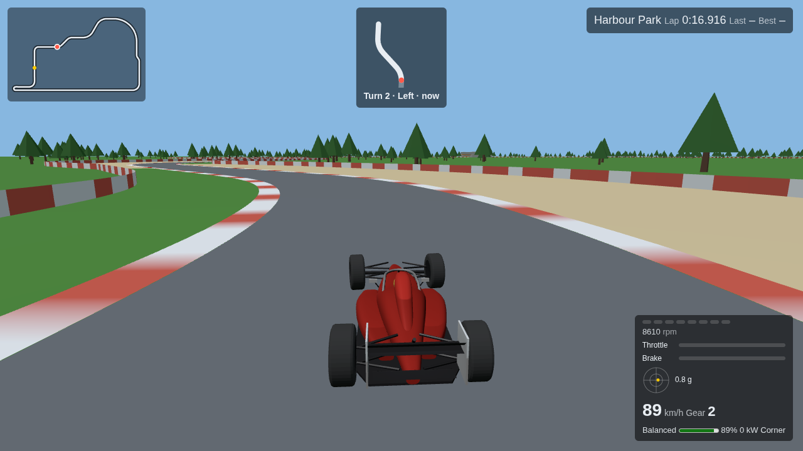
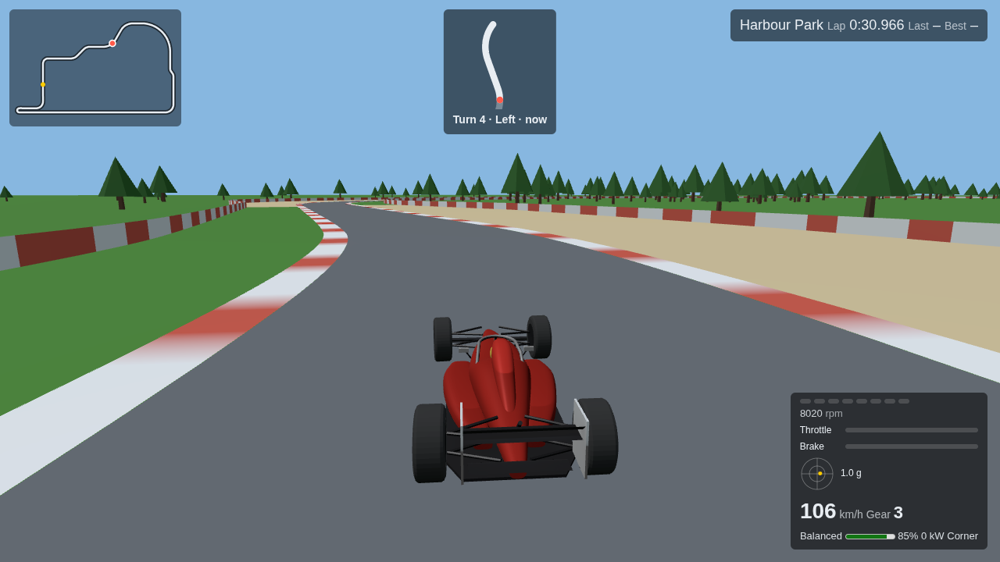
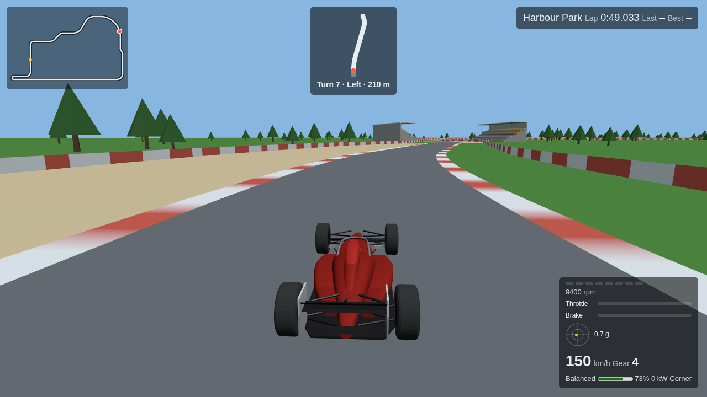

# Phase 5 checkpoint record

Phase: [P5](../phases/P5-release.md), measured by [PERF-001](../performance/PROTOCOL.md).
Started while P4 waits on the real-model check (see [P4](P4.md)); the benchmark
tooling does not depend on it, but the baseline runs must use the real `fr26.glb`.

## P5-C1 — Benchmark route and reporting

State: done. Tooling verified, and the reference-laptop baseline is captured below.

**Route.** `?bench` on any build drives the fixed route `<track>-autopilot-v1`: the
deterministic autopilot (moved from test support to `src/app/autopilot.ts`) laps the
track. There is no randomness, so every run gets the same inputs. The route warms up
for 10 s (the 3 s countdown included), then measures 120 s. `warmupSeconds` and
`benchSeconds` shorten both for tests. The page then shows the report in
`#bench-report` and logs it as `formula-racer:bench`.

**Report** (`BenchReport`, `src/app/bench.ts`):

- frame time median/p95/p99/max and frames over the 16.7 ms budget
  (`src/app/frame-stats.ts`, nearest-rank);
- the same statistics for simulation time per frame and CPU-side render submission
  (GPU work is asynchronous and not in `renderMs`);
- mean draw calls and triangles (`renderer.info`), drawing-buffer size, pixel ratio and
  preset;
- the unmasked WebGL vendor and renderer, the user agent, and the bytes transferred
  for the page and its assets.

**Runner.** `make bench QUALITY=medium` builds, serves `dist/`, and runs three GPU-backed headless
Chromium passes at 1280×720 with the preset preloaded. It writes
`docs/performance/runs/<time>-<preset>.json` (summary plus every pass). The summary
takes the median pass for each figure and the worst p95. It is marked
`hardware: false`, and can never count as meeting the target, whenever any pass
rendered on SwiftShader/llvmpipe.

Tests: 5 bench-option/recorder, 3 frame-summary and 3 run-summary unit tests, plus a
browser test that runs a 2 s bench and checks the report's fields and that the car
covered ground. `make lint` passes; Chromium browser 29/29.

Headless check in the cloud session (software GL, **not a performance result**):
`bun run tools/bench.ts --headless --passes 2 --seconds 3 --warmup 3.5` ran end to end
and wrote a summary. At Medium: 1280×720 buffer, p95 83.4 ms, about 11 draw calls and
15.3k triangles on the stand-in model. At Low: a 768-pixel-wide buffer, p95 33.4 ms.
SwiftShader was reported and flagged.

**Baseline** (2026-09-26, reference laptop, real `fr26.glb`, production build, AC
power, load average about 1). The renderer was ANGLE on Mesa Intel (LNL), OpenGL ES 3.2,
so `hardware: true`. Each preset ran 3 passes of 120 s at 1280×720, GPU-backed headless
Chromium 153:

| Preset | Buffer   | p95 / p99 / max ms | Missed | Sim p95 / max ms | Render p95 / max ms | Draws | Triangles |
| ------ | -------- | ------------------ | ------ | ---------------- | ------------------- | ----- | --------- |
| Low    | 768×432  | 16.7 / 16.8 / 16.8 | 0      | 0.9 / 4.8        | 0.9 / 2.8           | 33    | 18.3k     |
| Medium | 1280×720 | 16.7 / 16.8 / 16.8 | 0      | 1.0 / 3.8        | 1.0 / 2.9           | 46    | 26.2k     |
| High   | 1280×720 | 16.7 / 16.8 / 16.8 | 0      | 1.0 / 2.3        | 1.1 / 3.0           | 46    | 39.3k     |

Every pass delivered 7,201 frames in 120 s, a locked 60 Hz, and all three presets meet
PERF-001. Summaries: `docs/performance/runs/2026-09-26T14-47…-low.json`, `…T14-53…-medium.json`
and `…T15-00…-high.json`. The two earlier Low runs predate the trackside scenery and are
superseded.

**Limiting stage: the 60 Hz frame clock.** Simulation plus render submission is about
2 ms at p95, 12% of the budget. The worst single frame's CPU work is under 5 ms. The GPU
finishes inside each refresh even at High, since no frame is longer than 16.8 ms. The
bench cannot show headroom beyond 60 Hz, because headless frames are paced by Chromium's
own clock. Nor does it measure GPU time directly.

Consequence for C2: no stage misses the budget, so this evidence justifies no
optimization. PERF-001 forbids optimizing without it.

### Review fixes (PR #7 Codex comments and an independent review)

Each finding was reproduced with a failing test before the fix.

`beee51e`, the Codex PR comments (replied on each thread):

- Track limits come from each tyre's position under the chassis pose, so a sliding
  car with one tyre on the kerb stays valid (`tests/track-limits.test.ts`).
- A `startDistanceM` past the end of the lap is a content error (`session.test.ts`).
- The bench autopilot is sampled every simulation step, so the route drives the same
  at 20 and 60 Hz (`session.test.ts`).
- A missed refresh is a frame of at least 1.5 budgets, and the p95 target allows
  Chromium's 0.1 ms timestamp rounding, so locked-60 Hz passes don't report
  about 1800 false misses (`frame-stats.test.ts`, `bench-runs.test.ts`).
- The site build fails on Git LFS pointer files (`site-build.test.ts`).
- Barrier colliders sit behind the drawn face, so the car stops where the wall is
  drawn (`surface.test.ts`).

`a01a783`, the independent review:

- Harvest mode no longer adds lift-off charging while braking (physics p3.5,
  `energy.test.ts`, `vehicle-energy.test.ts`).
- The deploy curve must start at 0 km/h (`energy-rules`).
- The median of an even number of passes averages the middle two.
- `--quality`, `--passes`, `--seconds` and `--warmup` are validated.
- The corner-grandstand cap counts separately from the main stand.
- The bench browser test runs on the fake clock, so it is no longer flaky.

Gates after both commits: lint clean, 349 unit tests, Chromium browser 31/31.

## P5-C2 — Optimization

State: done, with no code changes. The phase lists LOD, material cost, scenery
instancing, shadows and adaptive resolution as candidates, but only for evidenced
bottlenecks. The C1 baseline shows none: every preset holds 60 Hz with no missed
refresh, and CPU work is about 2 ms of the 16.7 ms budget. The scenery work in P4-C4
already batched static geometry into 250 m cells and instanced the trees, both
measured with hyperfine at the time ([P4](P4.md)). Adding adaptive resolution or
cutting LOD now would lower quality for no measured gain.

If a future machine misses the target, rerun `make bench` there first and optimize the
stage it names.

## P5-C3 — Final verification

State: done.

**Verification.** `make lint` passes. `make test` passed at `13f3669` with 354 unit
tests and 31/31 Chromium browser tests. No code has changed since then
(`git diff 13f3669 -- src tests tools` is empty), only docs, run data and `make help`
text. Browser testing is Chromium only, by the user's decision.

**Screenshots.** Taken on the High preset at 1280×720 in GPU-backed headless Chromium,
with the benchmark autopilot driving Harbour Park:

| Turn 2                         | Turn 4                          | Approaching turn 7               |
| ------------------------------ | ------------------------------- | -------------------------------- |
|  |  |  |

They show the track map, the corner preview, the telemetry dashboard, gravel on the
corner outsides, barriers, trees and grandstands. The pedal bars read zero because the
autopilot coasts whenever it is within 5% of its target speed. `dashboard.pw.ts` checks
that the bars fill. `p5-start.png` shows the grid.

**Known limitations** of the delivered game:

- Single-player time trial only: no opponents, ghosts or multiplayer.
- Keyboard input only: no gamepad or touch, so it is not playable on phones or tablets.
- Two circuits: Harbour Park (about 3.9 km) and the small Test Loop.
- Browser testing is Chromium only (user, 2026-09-26). Firefox and Safari are
  untested, and so are the production and subpath builds in a browser.
- Audio is covered by tests of the sound model and Web Audio wiring, but nobody has
  confirmed by ear that it plays.
- Performance was measured on one laptop (Intel Core Ultra 7 268V, Arc 140V) in headless
  Chromium. That caps frames at 60 Hz and does not time the GPU directly, so headroom
  above 60 fps and other GPUs are unknown.
- No CI runs the tests; they run locally through `make test`.

Early C3 evidence from the cloud session (2026-09-26, real `fr26.glb`, SwiftShader): the
production matrix passed 52/52 against a fresh `dist/`
(`bun run test:browser:full --project=chromium-prod --project=chromium-prod-subpath`).
Firefox (`firefox-dev`, `firefox-prod-subpath`) and `make assets-verify` (Blender) were
not run: neither Firefox nor Blender is installed there.

## Phase review

Codex `gpt-6-astra` was out of usage, and the Antigravity fallback failed: the diff was
too large to pass as an argument, and reading the repository directly timed out. An
independent review agent reviewed `1728a3e^..HEAD` instead. It found no high-severity
defects. Each confirmed defect was reproduced by a failing test, except where noted:

| Finding                                                                                                                | Fix                                                                                 | Test                                                                       |
| ---------------------------------------------------------------------------------------------------------------------- | ----------------------------------------------------------------------------------- | -------------------------------------------------------------------------- |
| With ABS off, regen counted a locked rear tyre's full brake request, so slippery surfaces harvested as much as asphalt | `a53cef6`: regen capped at what the tyre grips (physics p3.6)                       | `vehicle-energy.test.ts` "with ABS off, a locked rear tyre…"               |
| The benchmark measured paused frames (window focus lost)                                                               | `3919e9d`: paused frames are counted, not measured, and the runner rejects the pass | `bench.test.ts`, `bench-runs.test.ts`                                      |
| Turns were numbered from the centreline's first sample, not the start line                                             | `632dac0`                                                                           | `track-map.test.ts` "turn 1 is the first corner after the start line…"     |
| A missing `#track-map` leaked the session, model and WebGL view                                                        | `9dbcd35`: checked before anything is created                                       | None: the leak cannot be observed without mocking WebGL and Rapier         |
| The runner rejected `--warmup 0` and fractional `--seconds`, which the page accepts                                    | `dded701`                                                                           | `bench-runs.test.ts` (the old whole-number assertion encoded the mismatch) |

Still open, plausible but unconfirmed: a manual `?bench` visit in a normal browser
profile can save an autopilot lap as a best (`make bench` uses a fresh profile).
Gravel drag's no-reverse cap assumes body mass equals `car.massKg`. Tree
`InstancedMesh` buffers are not disposed, and the view is never rebuilt. The reviewer
also suggested more tests: runoff zones wrapping past sample 0, a corner crossing the
lap line in `nextCorner`, and stands clear of other stretches' runoff.

Gates: `make lint` passes; `make test` 357 unit tests and 31/31 Chromium browser tests.

## Handoff

- Uncommitted work: none.
- Next executable action: none. P5 is complete, and the PR is ready for the user's review (don't merge).
